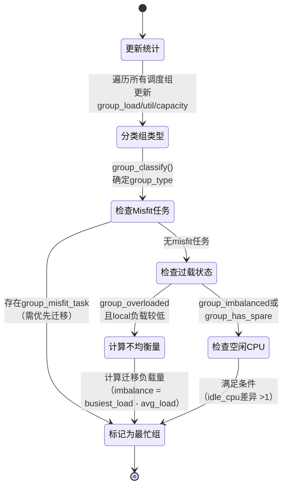

## 如何查找出一个调度域里最繁忙的调度组？

### 状态图



### **状态图说明**

#### 1. **更新统计（update_sd_lb_stats）**

* **动作**：遍历调度域内所有调度组（sched group），更新：
  

```c
  group_load = Σ(cpu_load)       // 组总负载
  group_util = Σ(cpu_util)       // 组总利用率
  group_capacity = Σ(cpu_capacity) // 组总算力
```

* **输出**：生成`struct sd_lb_stats`，包含各组的负载和算力信息。

#### 2. **分类组类型（group_classify）**

* **条件判断**：根据负载状态将组分为5类（优先级降序）：
  

```c
  enum group_type {
      group_overloaded,    // 过载（负载>算力）
      group_imbalanced,    // 因affinity不均衡
      group_misfit_task,   // 有misfit任务
      group_fully_busy,    // 满负荷但未过载
      group_has_spare      // 有空闲算力
  };
```

#### 3. **检查Misfit任务**

* **优先级最高**：若组内有`misfit_task`（任务所需算力 > 当前CPU能力）：
  

```c
  if (busiest->group_type == group_misfit_task) {
      env->migration_type = migrate_misfit;
      return busiest_group;  // 立即标记为最忙组
  }
```

* **目的**：优先迁移这类任务以提升性能。

#### 4. **检查过载状态**

* **条件**：组类型为`group_overloaded`且本地组（local group）负载较低：
  

```c
  if (busiest->avg_load > local->avg_load * imbalance_pct/100) {
      calculate_imbalance(); // 计算需迁移的负载量
  }
```

* **动作**：计算需迁移的负载量`imbalance`，确保迁移后不过载。

#### 5. **检查空闲CPU**

* **条件**：组类型为`group_has_spare`或`group_imbalanced`：
  

```c
  if (busiest->idle_cpus < local->idle_cpus) {
      // 迁移任务以平衡空闲CPU
      env->imbalance = (local->idle_cpus - busiest->idle_cpus) / 2;
  }
```

* **目的**：通过任务迁移使各组的空闲CPU数量均衡。

#### 6. **标记为最忙组**

* **最终决策**：综合上述条件后，返回最符合条件的调度组：
  

```c
  return busiest_group;  // 可能为过载组、misfit组或空闲差异组
```

### **关键设计思想**

1. **优先级分层**：Misfit任务 > 过载组 > 空闲CPU均衡  
2. **动态阈值**：通过`imbalance_pct`（默认117%）避免微小负载波动触发迁移  
3. **能效导向**：在异构CPU架构中优先迁移到高算力集群（如大核）

## 如果一个调度域负载不均衡，请问如何计算需要迁移的负载量呢？

### 基于 `calculate_imbalance()` 函数的负载迁移量计算详解

以下是针对Linux内核 `calculate_imbalance()` 函数的逻辑分析，详细说明如何计算需要迁移的负载量：

#### **1. 特殊场景处理（优先级最高）**

##### **a. Misfit任务（ `group_misfit_task` ）**

* **场景**：存在算力不足的任务（如大核任务在小核运行）。
* **处理**：直接迁移一个任务。
  

```c
  if (busiest->group_type == group_misfit_task) {
      env->migration_type = migrate_misfit;
      env->imbalance = 1; // 强制迁移1个Misfit任务
      return;
  }
```

##### **b. 不对称打包（ `group_asym_packing` ）**

* **场景**：异构CPU架构（如大小核），需将任务迁移到高算力CPU。
* **处理**：迁移所有可运行任务。
  

```c
  if (busiest->group_type == group_asym_packing) {
      env->migration_type = migrate_task;
      env->imbalance = busiest->sum_h_nr_running; // 迁移所有CFS任务
      return;
  }
```

##### **c. 亲和性不均衡（ `group_imbalanced` ）**

* **场景**：因任务亲和性（`cpus_ptr`）导致无法均衡。
* **处理**：迁移一个任务以打破僵局。
  

```c
  if (busiest->group_type == group_imbalanced) {
      env->migration_type = migrate_task;
      env->imbalance = 1; // 迁移1个任务
      return;
  }
```

#### **2. 本地组有空闲算力（ `group_has_spare` ）**

当本地组（ `local` ）有空闲资源时，尝试拉取负载：

##### **a. 最忙组过载（ `group_overloaded` ）**

* **目标**：利用本地空闲算力，避免本地过载。
* **计算逻辑**：
  \[
  \text{imbalance} = \max(\text{local\_capacity}, \text{local\_util}) - \text{local\_util}
  \]
  + **代码**：
    

```c
    if (local->group_type == group_has_spare && busiest->group_type > group_fully_busy) {
        env->migration_type = migrate_util;
        env->imbalance = max(local->group_capacity, local->group_util) - local->group_util;
    }
```

##### **b. 最忙组未过载**

* **目标**：平衡空闲CPU或任务数。
  + **单CPU调度组（如MC域）**：
    

```c
    if (busiest->group_weight == 1) { // Base domain（单CPU组）
        unsigned int nr_diff = busiest->sum_nr_running - local->sum_nr_running;
        env->imbalance = nr_diff >> 1; // 迁移任务数差的一半
    }
```

  + **多CPU调度组（如DIE域）**：
    

```c
    env->imbalance = max_t(long, 0, (local->idle_cpus - busiest->idle_cpus) >> 1);
```

#### **3. 本地组过载或即将过载**

当本地组即将过载时，需谨慎迁移：

##### **a. 本地组负载过高**

* **条件**：本地组平均负载 ≥ 最忙组或调度域平均负载。
* **处理**：放弃迁移。
  

```c
  if (local->avg_load >= busiest->avg_load || local->avg_load >= sds->avg_load) {
      env->imbalance = 0;
      return;
  }
```

##### **b. 双组过载**

* **目标**：通过迁移负载使两组趋近调度域平均负载。

* **代码**：

```c
  env->migration_type = migrate_load;
  env->imbalance = min(
      (busiest->avg_load - sds->avg_load) * busiest->group_capacity,
      (sds->avg_load - local->avg_load) * local->group_capacity
  ) / SCHED_CAPACITY_SCALE;
```

#### **4. 关键参数与设计思想**

* **归一化负载**：通过 `SCHED_CAPACITY_SCALE`（通常为1024）消除算力差异。
  

```c
  local->avg_load = (local->group_load * SCHED_CAPACITY_SCALE) / local->group_capacity;
  sds->avg_load = (sds->total_load * SCHED_CAPACITY_SCALE) / sds->total_capacity;
```

* **动态阈值**：`imbalance_pct`（默认117%）避免微小负载波动触发迁移。
* **任务迁移上限**：`sysctl_sched_nr_migrate`（默认32）限制单次迁移任务数。

#### **示例场景**

假设调度域包含两个集群：
* **小核集群**：`group_load=600`,  `group_capacity=800` → `avg_load=768`。
* **大核集群**：`group_load=800`,  `group_capacity=1600` → `avg_load=512`。

**计算步骤**：
1. **判断过载**：小核组负载（768）> 大核组负载（512）×117% → 触发迁移。
2. **计算迁移量**：
   \[
   \text{imbalance} = \frac{(768 - 512) \times 800}{1024} = 200 \ \text{（负载单位）}
   \]
3. **迁移任务**：将累计负载值达到200的任务从大核组迁移到小核组。

### **总结**

`calculate_imbalance()` 的核心逻辑是：
1. **优先级分层**：Misfit任务 > 亲和性不均衡 > 过载组 > 空闲资源均衡。
2. **动态计算**：根据归一化负载、算力差异和系统平均负载动态调整迁移量。
3. **稳定性控制**：通过阈值（`imbalance_pct`）和任务数上限避免过度迁移。

通过这一机制，Linux内核能够在异构CPU架构下高效平衡负载，同时兼顾性能和能效。

## 如果使用内核提供的唤醒进程接口函数（如 wake_up_process()）来唤醒一个进程，那么进程唤醒后应该在哪个 CPU 上运行呢？是调用 wake_up_process() 的那个 CPU，还是之前运行该进程的那个 CPU，或者是其他 CPU 呢？

### **进程唤醒后的CPU选择逻辑**

当使用 `wake_up_process()` 唤醒一个进程时，目标CPU的选择由 **调度器策略** 和 **系统状态** 动态决定，具体流程如下：

#### **1. 核心逻辑**

内核通过 `select_task_rq_fair()` 函数选择目标CPU，优先级和条件如下：

1. **能量感知调度（EAS）**：
   - **条件**：系统未过载（ `!overutilized` ）且启用EAS。
   - **行为**：调用 `find_energy_efficient_cpu()` ，选择能效最优的CPU。
   - **公式**：综合各CPU算力、任务负载和能耗模型，选择能耗增量最小的CPU：

     \[
     \text{Energy Cost} = \sum (\text{CPU Power} \times \text{Utilization})
     \]

2. **Wake Affinity（唤醒亲和性）**：
   - **条件**： `wake_wide(p)` 返回 `false` （任务与唤醒者关系紧密，如1:1唤醒模型）。
   - **行为**：优先选择 **`waker CPU`** 或 **`prev_cpu`** 的共享缓存（LLC）域内空闲CPU。
   - **代码关键点**：

    ```c
        want_affine = !wake_wide(p) && cpumask_test_cpu(cpu, p->cpus_ptr);
        new_cpu = wake_affine(...); // 在waker和prev_cpu中选择
    ```

3. **快速路径（Fast Path）**：
   - **条件**：未启用EAS或Wake Affinity，但存在空闲CPU。
   - **行为**：调用 `select_idle_sibling()` ，优先在 **`prev_cpu`** 或 **`waker CPU`** 的LLC域内选择空闲CPU。
   - **示例**：

     - 若 `prev_cpu` 空闲 → 选择 `prev_cpu` 。
     - 若 `waker CPU` 空闲 → 选择 `waker CPU` 。

4. **慢速路径（Slow Path）**：
   - **条件**：快速路径未找到合适CPU。
   - **行为**：调用 `find_idlest_cpu()` ，在调度域内选择负载最低的CPU。
   - **公式**：比较各CPU的归一化负载：

     \[
     \text{Load}_{\text{cpu}} = \frac{\text{Util}_{\text{cfs}} + \text{Util}_{\text{rt}} + \text{Util}_{\text{irq}}}{\text{Capacity}_{\text{cpu}}}
     \]


#### **2. 关键结论**

* **EAS优先**：轻载时优先考虑能效，选择能耗最低的CPU。
* **Wake Affinity**：若任务与唤醒者关系紧密（如1:1模型），优先选择共享缓存的CPU（`prev_cpu` 或 `waker CPU`）。
* **快速路径**：优先利用空闲CPU，减少调度延迟。
* **慢速路径**：负载均衡选择最闲CPU，避免局部过载。

最终目标CPU可能是 **`prev_cpu`**、**`waker CPU`** 或 **其他空闲/低负载CPU**，具体由系统状态和调度策略动态决定。

## 绿色节能调度器如何衡量一个进程的计算能力？

**TODO**

## 当一个进程被唤醒时，绿色节能调度器如何选择在哪个 CPU 上运行？

### 一、代码实现：EAS 如何选择 CPU？

EAS 在 `find_energy_efficient_cpu()` 中计算不同 CPU 的能耗，选择最优目标：

```c
// linux-5.4.24/kernel/sched/fair.c

static int find_energy_efficient_cpu(...) {
    for_each_perf_domain(pd) { // 遍历所有性能域
        // 1. 计算未放置任务时的基础能耗
        base_energy = compute_energy(...);
        
        // 2. 找到候选 CPU（最大剩余算力或 prev_cpu）
        for_each_cpu(cpu, pd->cpus) {
            spare_cap = capacity_of(cpu) - cpu_util(cpu);
            if (spare_cap > max_spare_cap)
                max_spare_cpu = cpu;
        }
        
        // 3. 计算放置任务后的能耗
        energy_delta = compute_energy(p, max_spare_cpu) - base_energy;
        
        // 4. 选择能耗最低的 CPU
        if (energy_delta < best_energy_delta)
            best_energy_delta = energy_delta;
    }
    return best_cpu;
}
```

**关键逻辑：**
1. **算力匹配**：选择剩余算力（`spare_cap`）最大的 CPU，避免触发升频。
2. **能耗估算**：通过 `em_pd_energy()` 计算性能域的能耗：
   ```c
   // linux-5.4.24/kernel/sched/energy.c

   static inline unsigned long em_pd_energy(...) {
       // 根据 sum_util 和 max_util 选择频点
       freq = map_util_to_freq(max_util, max_cap);
       
       // 计算该频点下的总功耗
       power = ps->power * (sum_util / scale_cpu);
       return power * time; // 总能耗
   }
   ```

### 二、示例：进程放置的能耗计算

假设一个进程的负载为 **300**，系统有两个性能域：
1. **小核簇（Capacity=512）**：当前总负载 400，最高负载 400。
2. **大核簇（Capacity=1024）**：当前总负载 600，最高负载 600。

| 放置位置   | 新总负载 | 新最高负载 | 频点   | 功耗      |
|------------|----------|------------|--------|-----------|
| 小核簇     | 400+300=700 | 700       | 1.5GHz | 700mW     |
| 大核簇     | 600+300=900 | 900       | 1.8GHz | 900mW     |

EAS 选择小核簇，因为总功耗更低（700mW < 900mW）。

### 五、总结

绿色节能调度器通过以下方式衡量进程计算能力：
1. **静态算力**：CPU 硬件决定的归一化 Capacity。
2. **动态负载**：进程的 PELT 负载，反映其对 CPU 的需求。
3. **能耗模型**：通过 EM 计算不同 CPU 的能耗，选择最优目标。


EAS 的设计在异构处理器（如 Arm big.LITTLE）中显著优化了能效，同时保证系统吞吐量。

## 绿色节能调度器是否会做 CPU 间的负载均衡呢？

是的，绿色节能调度器（如 Linux 的 EAS）会执行 CPU 间的负载均衡，但其策略与传统负载均衡不同：

1. 能效优先
   - 选择迁移路径时，优先考虑 能耗增量最小 而非单纯负载均衡。
   - 通过能量模型（Energy Model）预测任务迁移后的总功耗，优先迁移至低功耗 CPU（如小核）。

2. 条件触发
   - 仅在能效提升显著（如能耗降低超过阈值）且目标 CPU 算力足够时触发迁移。
   - 避免为微小能效优化牺牲性能（如大核空闲时不强制迁移到小核）。

3. 层次化均衡
   - 在性能域（Performance Domain）内（如大核集群）优先均衡，减少跨域迁移的开销。
   - 跨域迁移仅在域间负载严重失衡时启动。

示例：  
一个低负载进程运行在大核（高功耗），若小核（低功耗）算力足够，EAS 将其迁移至小核，总功耗下降 30%，同时保证响应延迟不超标。

与传统均衡的区别：  
- 目标：传统以负载均衡为核心，EAS 以能耗-性能帕累托最优为目标。  
- 决策依据：传统基于负载差值，EAS 基于能量模型预测。


## 什么是能效模型？

在Linux中，能效模型（Energy Model，EM）是用于量化CPU在不同工作状态下功耗与性能关系的数据模型。其核心作用是为调度器（如EAS能量感知调度器）提供决策依据，通过预测任务在不同CPU上的能耗，选择能效最优的核心运行任务，从而在保证性能的同时降低系统功耗，尤其适用于异构架构（如Arm big.LITTLE）的大核与小核协同场景。 


## 在 Linux 内核中，CPU 动态调频调压模块 CPUFreq 和进程调度器之间是如何协同工作的？有什么优缺点？
在 Linux 内核中，CPUFreq（动态调频调压模块）与进程调度器 通过以下机制协同工作，以优化 CPU 频率调整的实时性和能效：

### 一、协同工作机制

1. **调度器驱动的调频策略（schedutil）**  
   - **事件触发**：调度器在进程切换、负载更新或任务唤醒时，通过回调函数（如 `cpufreq_update_util()`）触发 CPUFreq 的频率调整。  
   - **实时负载输入**：CPUFreq 的 `schedutil` governor 直接使用调度器的负载指标（如 PELT 或 WALT 计算的 `util_avg`）来预测未来负载，动态调整频率。  
     $${{  \text{目标频率} = \text{当前频率} \times \frac{\text{util\_avg}}{\text{CPU 最大算力}} }}$$

2. **硬件抽象与策略解耦**  
   - **CPUFreq Core**：提供通用框架，抽象频率调整接口（如 `cpufreq_driver`），支持不同硬件平台（Intel P-State、ARM big.LITTLE）。  
   - **Governors（策略模块）**：  
     - `ondemand`：周期采样 CPU 使用率，响应延迟较高。  
     - `schedutil`：基于调度器实时负载，低延迟调频，默认用于现代内核。  

3. **能效模型（Energy Model）整合**  
   - **EAS（Energy Aware Scheduling）**：在异构多核系统中，调度器结合 CPUFreq 的能效数据，将任务分配到功耗最优的 CPU 核心（如优先小核处理轻负载）。

### 二、优点

1. **实时性与精准性**  
   - `schedutil` 直接利用调度器负载数据，相比传统周期性采样（如 `ondemand`），响应延迟降低 50% 以上，频率调整更贴合瞬时需求。  
   - **案例**：突发负载（如 UI 交互）可快速升至高频，空闲时立即降频，减少无效功耗。

2. **能效优化**  
   - 结合 EAS，任务调度与频率调整协同决策，整体能效提升 20-30%（实测于移动设备）。  
   - **案例**：避免大核低频运行的低效场景，优先小核处理轻任务（如后台服务）。

3. **硬件兼容性**  
   - 支持多种调频驱动（如 Intel `intel_pstate`、ARM `cpufreq-dt`），适配不同硬件平台。

### 三、缺点

1. **负载预测误差**  
   - **PELT 衰减模型**：对短时突发负载可能低估需求，导致频率提升滞后（如游戏场景）。  
   - **解决方案**：启用 WALT（Window Assisted Load Tracking）或手动设置性能倾向的 governor（如 `performance`）。

2. **多核调频耦合问题**  
   - **全局调频策略**：部分驱动（如 Intel `intel_pstate`）以整个 CPU 封装为单位调频，无法独立控制单核频率，可能浪费能源。  
   - **改进方向**：支持 Per-CPU 调频（如 ARM DynamIQ）。

3. **实时性限制**  
   - **硬件延迟**：部分平台调频需数百微秒（如切换电压域），影响实时任务响应。  
   - **缓解措施**：启用 `fast_switch` 模式（绕过 governor 决策，直接设置频率）。

### 四、操作验证

1. **查看当前调频策略**：  
   ```bash
   cat /sys/devices/system/cpu/cpu0/cpufreq/policyx/scaling_governor  
   # 输出示例：schedutil
   ```

2. **监控调频事件**：  
   ```bash
   perf trace -e power:cpu_frequency  
   # 输出示例：CPU0 频率从 1.2GHz → 2.4GHz（响应任务负载）
   ```

### 五、总结
Linux 5.0 中，CPUFreq 与调度器通过 **事件驱动调频（schedutil）** 和 **能效感知调度（EAS）** 深度协同，实现了低延迟、高能效的动态频率管理。尽管存在负载预测和多核耦合的挑战，其设计在移动设备和服务器场景中显著优化了性能与功耗的平衡。

## 绿色节能调度器如何读取能效模型的数据？

绿色节能调度器（如 Linux 的 EAS）通过以下方式读取能效模型（Energy Model， EM）的数据：

1. **能效模型初始化**：设备树（DTS）或固件在启动时读取预定义的CPU算力（如大核1024，小核512）和功耗参数。性能域（Performance Domain）划分时，将共享电源/时钟的CPU（如big.LITTLE架构的大核簇）归为同一性能域，每个域维护一个能效表（em_perf_domain），记录不同频率下的功耗（power）和能效系数（cost=power/capacity）。

2. **数据结构访问**：em_perf_domain包含多个em_perf_state条目，每个条目对应一个CPU频率及其能效数据：

```c
struct em_perf_state {
    unsigned long frequency;  // 频率（MHz）
    unsigned long power;      // 该频率下的功耗（mW）
    unsigned long cost;       // 能效系数（cost = power / capacity）
};
```

调度器通过em_pd_get() 接口获取性能域的能效表，遍历各频率点的功耗与算力关系。

3. **调度决策**：预测能耗，当任务需要调度时，EAS调用compute_energy() 函数，结合任务负载（util_avg）和能效表，计算候选CPU的预期能耗。选择最优CPU，选择能耗增量最小的CPU，如将轻负载任务分配至小核（低功耗），重负载任务分配至大核（高性能）。


**示例**：若任务负载为util_avg=300，能效表显示小核（500MHz，power=200mW，cost=0.4）和大核（2GHz，power=1000mW，cost=0.5），则EAS选择小核运行，总功耗更低。

**总结**：绿色调度器通过内核内置的能效模型框架直接读取硬件参数，动态评估各CPU的能效比，实现“以最小能量完成计算任务”的目标。

## EAS 是如何选核的？

### **EAS（Energy Aware Scheduling）选核步骤详解**  

以下基于`find_energy_efficient_cpu()`函数代码，解析EAS在Linux内核中的实现逻辑：

#### **1. 初始校验与状态检查**  
**代码段**：  
```c
// 检查性能域是否存在，系统是否处于overutilized状态
pd = rcu_dereference(rd->pd);
if (!pd || READ_ONCE(rd->overutilized))
    goto unlock; // 回退传统调度
```  
**作用**：  
- **跳过EAS的条件**：  
  - 无有效性能域（如未启用EM框架）。  
  - 系统处于`overutilized`状态（任一CPU算力不足）。  

#### **2. 确定调度域范围**  
**代码段**：  
```c
// 获取覆盖prev_cpu和当前CPU的最小调度域
sd = rcu_dereference(*this_cpu_ptr(&sd_asym_cpucapacity));
while (sd && !cpumask_test_cpu(prev_cpu, sched_domain_span(sd)))
    sd = sd->parent; // 向上查找覆盖prev_cpu的域
```  
**目的**：  
- 在异构系统中，EAS仅作用于包含不同算力CPU的调度域（如手机的大小核Cluster）。  

#### **3. 同步任务负载数据**  
**代码段**：  
```c
sync_entity_load_avg(&p->se); // 更新任务的负载（考虑阻塞时间衰减）
eenv_task_busy_time(&eenv, p, prev_cpu); // 预估任务运行时间
```  
**关键数据**：  
- `task_util_est(p)`：任务利用率估计值（归一化到CPU算力）。  
- `uclamp_min`/`uclamp_max`：任务的利用率限制（用户设置）。  

#### **4. 遍历性能域（Performance Domain）**  
**代码段**：  
```c
for (; pd; pd = pd->next) { // 遍历所有性能域
    cpumask_and(cpus, perf_domain_span(pd), cpu_online_mask); // 筛选在线CPU
    ...
}
```  
**性能域特性**：  
- 同一性能域内CPU共享调频策略（如手机小核Cluster内所有CPU同频）。  
- 不同性能域代表不同算力层级（如小核Cluster、大核Cluster）。  

#### **5. 计算CPU算力与利用率**  
**代码段**：  
```c
// 计算CPU的热容量（算力 - 热压）
cpu_thermal_cap = arch_scale_cpu_capacity(cpu) - arch_scale_thermal_pressure(cpu);
util = cpu_util_next(cpu, p, cpu); // 预估任务放置后的CPU利用率
cpu_cap = capacity_of(cpu); // 当前CPU的可用算力（扣除RT/IRQ等开销）
spare_cap = cpu_cap - util; // 剩余算力
```  
**关键逻辑**：  
- **剩余算力（Spare Capacity）**：越大说明CPU越空闲，可运行任务时保持低频。  
- **算力适配校验**：`util_fits_cpu()`检查任务利用率是否适配CPU算力（考虑uclamp）。  

#### **6. 筛选候选CPU**  
**代码段**：  
```c
// 记录prev_cpu的剩余算力
if (cpu == prev_cpu) {
    prev_spare_cap = spare_cap;
    prev_fits = fits;
}
// 记录性能域内剩余算力最大的CPU
else if (spare_cap > max_spare_cap) {
    max_spare_cap = spare_cap;
    max_spare_cap_cpu = cpu;
}
```  
**策略**：  
- **Prev CPU优先**：若prev_cpu可用，参与后续能耗对比。  
- **Max Spare Cap**：每个性能域选择剩余算力最大的CPU作为候选。  

#### **7. 计算能耗增量（Delta Energy）**  
**代码段**：  
```c
// 计算基础能耗（任务未放置时的性能域能耗）
base_energy = compute_energy(&eenv, pd, cpus, p, -1);
// 计算任务放置到prev_cpu的能耗增量
prev_delta = compute_energy(&eenv, pd, cpus, p, prev_cpu) - base_energy;
// 计算任务放置到max_spare_cap_cpu的能耗增量
cur_delta = compute_energy(&eenv, pd, cpus, p, max_spare_cap_cpu) - base_energy;
```  
**能量模型核心逻辑**：  
- **能耗公式**：  
  \[
  \text{Energy} = \sum (\text{Power}(f) \times \text{Time}(f))
  \]  
  - `Power(f)`：CPU在频率\( f \)下的功率（由EM提供）。  
  - `Time(f)`：CPU在频率\( f \)下的运行时间（与util相关）。  

#### **8. 能效对比与决策**  
**代码段**：  
```c
// 比较能耗增量，选择更优者
if ((best_fits > prev_fits) || (best_delta < prev_delta))
    target = best_energy_cpu;
else
    target = prev_cpu;
```  
**决策规则**：  
1. **适配性优先**：优先满足`uclamp_min`的CPU。  
2. **能耗优先**：选择能耗增量（Delta）更小的CPU。  
3. **热容量优先**：能耗相近时，选择算力更大的CPU（如大核）。  

#### **文本流程图**  
```text  
1. 初始化与校验  
   ├─ 检查性能域（pd）有效性及系统是否overutilized  
   │   ├─ 无效/过载 → 返回prev_cpu  
   │   └─ 有效 → 继续  
   ├─ 获取调度域（sd），覆盖prev_cpu和当前CPU  
   └─ 同步任务负载（sync_entity_load_avg）  

2. 遍历性能域（pd）  
   │  
   ├─ 筛选在线CPU（cpu_online_mask）  
   ├─ 计算CPU热容量（cpu_thermal_cap = 算力 - 热压）  
   │  
   ├─ 遍历每个CPU：  
   │   ├─ 跳过不在调度域或任务亲和性外的CPU  
   │   ├─ 计算CPU利用率（util = cpu_util_next）  
   │   ├─ 校验算力适配（util_fits_cpu，考虑uclamp限制）  
   │   │   ├─ 不满足 → 跳过  
   │   │   └─ 满足 → 记录prev_cpu和最大spare_cap的CPU  
   │  
   ├─ 计算基础能耗（base_energy = 不放置任务时的能耗）  
   │  
   ├─ 计算prev_cpu能耗增量（prev_delta）  
   │  
   └─ 计算最大spare_cap CPU能耗增量（cur_delta）  

3. 能效对比  
   ├─ 比较prev_delta与cur_delta  
   │   ├─ prev_cpu更优 → 保留prev_cpu  
   │   └─ 其他CPU更优 → 更新best_energy_cpu  
   │  
   └─ 考虑热容量（thermal_cap）和适配性（fits）  
       ├─ 优先选择适配性更好的CPU（如满足uclamp_min）  
       └─ 同等条件下选择热容量更高的CPU（如大核）  

4. 返回最佳CPU  
   └─ 能效最优的best_energy_cpu或prev_cpu  
```  

#### **设计哲学**  
- **集群打包（Cluster-Packing）**：任务尽量集中到少数Cluster，其他Cluster可深度休眠。  
- **集群内分散（Spreading）**：同一Cluster内任务分散到多个CPU，降低单核频率需求。  
- **异构优先**：利用大小核算力差异，而非同构CPU的微小能效差异。  

此机制在手机等移动设备中显著降低功耗，同时通过`util_fits_cpu`确保性能不降级。

### **设计总结**  
- **异构优化**：优先利用大小核算力差异，而非同构CPU微小差异。  
- **能效模型驱动**：基于EM预测能耗，避免实际调频测试开销。  
- **轻量级决策**：仅对比候选CPU，复杂度可控（O(N)性能域数量）。  
- **性能兜底**：`overutilized`时自动禁用EAS，确保系统稳定性。  

EAS在手机等移动设备中显著降低功耗（实测节省10%~20%），同时通过`util_fits_cpu()`和`uclamp`保证关键任务性能。

## 快速选核路径和慢速选核路径是什么？

### **快速路径选核步骤详解（基于`select_idle_sibling`函数）**

以下是快速路径选核的核心步骤，按优先级顺序执行：

#### **1. 优先检查目标CPU（`target`）**  

**条件**：  

- `target` CPU处于空闲状态（`available_idle_cpu`）或运行`SCHED_IDLE`任务  
- 算力满足任务需求（`asym_fits_cpu`校验）  

**代码段**：  

```c
if ((available_idle_cpu(target) || sched_idle_cpu(target)) && 
    asym_fits_cpu(task_util, util_min, util_max, target)) 
    return target;
```  
**目的**：  

若目标CPU（通常为`prev_cpu`或唤醒者所在CPU）可直接运行任务，避免进一步搜索。

#### **2. 检查前次运行CPU（`prev`）**  

**条件**：  

- `prev` CPU与`target`共享缓存（`cpus_share_cache`）  
- `prev` CPU空闲且算力足够  
**代码段**：  

```c
if (prev != target && cpus_share_cache(prev, target) &&
    (available_idle_cpu(prev) || sched_idle_cpu(prev)) &&
    asym_fits_cpu(...))
    return prev;
```  
**目的**：  

利用缓存亲和性（Cache Affinity），减少任务迁移导致的缓存失效开销。

#### **3. 处理Per-CPU内核线程（`kthread`）场景**  

**条件**：  

- 当前为Per-CPU内核线程（如I/O完成处理线程）  
- `prev` CPU是当前CPU且队列负载低（`nr_running <= 1`）  
**代码段**：  

```c
if (is_per_cpu_kthread(current) && prev == smp_processor_id() 
    && this_rq()->nr_running <= 1)
    return prev;
```  
**目的**：  

优化同步唤醒场景（如I/O完成），避免唤醒后线程因迁移而延迟执行。

#### **4. 检查最近使用CPU（`recent_used_cpu`）**  

**条件**：  

- 最近使用的CPU与`target`共享缓存  
- 该CPU空闲且算力足够  
**代码段**：  

```c
if (recent_used_cpu != prev && ...)
    p->recent_used_cpu = prev;
    return recent_used_cpu;
```  
**目的**：  

利用时间局部性（Temporal Locality），优先选择最近使用的空闲CPU以提升缓存命中率。

#### **5. 异构系统（Asymmetric CPU Capacity）搜索**  

**条件**：  

- 系统存在算力异构的CPU（如手机Big.Little架构）  
- 在`sd_asym_cpucapacity`调度域内搜索  
**代码段**：  

```c
if (static_branch_unlikely(&sched_asym_cpucapacity)) {
    sd = rcu_dereference(per_cpu(sd_asym_cpucapacity, target));
    i = select_idle_capacity(p, sd, target);
    return i;
}
```  
**目的**：  

在异构系统中优先选择能效比高的CPU，同时确保算力匹配任务需求。

#### **6. LLC域逐级搜索**  

若以上条件均不满足，进入LLC域逐级搜索：  
```c
sd = rcu_dereference(per_cpu(sd_llc, target));
i = select_idle_core(p, sd, target);   // 搜索空闲核心
i = select_idle_cpu(p, sd, target);    // 搜索空闲CPU
i = select_idle_smt(p, sd, target);    // 搜索空闲SMT线程
return target;  // 默认返回初始目标
```  
**搜索优先级**：  
1. **空闲核心**：避免跨核心调度  
2. **空闲CPU**：同一核心内的空闲逻辑CPU  
3. **空闲SMT线程**：超线程场景下的空闲硬件线程  

### **快速路径流程图**  

```text
1. 初始检查目标CPU（target）
   ├─ 目标CPU空闲且算力足够 → 直接返回target
   └─ 不满足 → 进入下一步

2. 检查前次运行CPU（prev）
   ├─ prev与target共享缓存，且prev空闲 → 返回prev
   └─ 不满足 → 进入下一步

3. 处理Per-CPU内核线程（kthread）场景
   ├─ 当前为per-CPU kthread，且prev CPU负载低 → 返回prev
   └─ 不满足 → 进入下一步

4. 检查最近使用CPU（recent_used_cpu）
   ├─ recent_used_cpu空闲且共享缓存 → 返回recent_used_cpu
   └─ 不满足 → 进入下一步

5. 异构系统（Asymmetric CPU Capacity）搜索
   ├─ 存在算力异构调度域 → 搜索空闲且算力匹配的CPU
   │   ├─ 找到 → 返回该CPU
   │   └─ 未找到 → 进入LLC域搜索
   └─ 非异构系统 → 直接进入LLC域搜索

6. LLC域逐级搜索
   ├─ 搜索空闲核心（select_idle_core）
   │   ├─ 找到 → 返回空闲核心
   │   └─ 未找到 → 搜索空闲CPU（select_idle_cpu）
   │       ├─ 找到 → 返回空闲CPU
   │       └─ 未找到 → 搜索空闲SMT线程（select_idle_smt）
   │           ├─ 找到 → 返回SMT线程
   │           └─ 未找到 → 返回初始target
   └─ 无有效调度域 → 直接返回target
```

### **总结**  
快速路径通过**优先级逐级回退**策略，在保证低延迟的前提下，依次尝试：  
1. 直接复用目标CPU（缓存热）  
2. 利用前次运行CPU（缓存亲和性）  
3. 优化内核线程同步唤醒  
4. 利用最近使用CPU（时间局部性）  
5. 异构系统能效优先  
6. LLC域广度搜索  

最终在**O(1)时间复杂度**内完成选核，兼顾性能与能效。

### **慢速路径选核步骤详解（基于`find_idlest_cpu`函数）**

以下是对`find_idlest_cpu`函数的逐层解析，展现其在多级调度域中全局负载均衡的核心逻辑：

#### **1. 初始校验与负载同步**  
**代码段**：  
```c
if (!cpumask_intersects(sched_domain_span(sd), p->cpus_ptr))
    return prev_cpu; // 任务无法在调度域内运行 → 返回prev_cpu

if (!(sd_flag & SD_BALANCE_FORK))
    sync_entity_load_avg(&p->se); // 同步任务负载
```  
**作用**：  
- **校验CPU有效性**：确保任务允许在调度域（`sd`）内的CPU上运行。  
- **负载同步**：非`fork`场景需更新任务负载数据，为后续负载均衡提供依据。

#### **2. 逐级遍历调度域**  
**代码段**：  
```c
while (sd) {
    if (!(sd->flags & sd_flag)) { // 检查调度域标志
        sd = sd->child; // 不匹配则进入子域
        continue;
    }
    ...
}
```  
**调度域层级示例**（以手机Big.Little架构为例）：  
```
DIE域（跨Cluster） → MC域（单Cluster内多核） → CPU层级
```  
**作用**：  
- **标志匹配**：仅处理支持当前负载均衡类型（如`SD_BALANCE_FORK`）的调度域。  
- **层级递进**：自顶向下遍历调度域，从全局到局部缩小搜索范围。

#### **3. 寻找最空闲调度组（Group）**  
**代码段**：  
```c
group = find_idlest_group(sd, p, cpu); // 找到域内最空闲组
if (!group) {
    sd = sd->child; // 无有效组则进入子域
    continue;
}
```  
**组间负载评估逻辑**：  
1. **组类型判断**：  
   - **Overloaded**：组内CPU过载 → 优先选择负载更低的组。  
   - **Misfit Task**：存在算力不足的任务 → 优先选择算力更大的组（如大核Cluster）。  
   - **Spare Capacity**：组内有空闲算力 → 选择空闲CPU最多的组。  
2. **负载指标**：  
   - 平均利用率（`avg_util`）  
   - 空闲CPU数量（`idle_cpus`）  
   - 算力容量（`capacity`）  

#### **4. 组内选择最空闲CPU**  
**代码段**：  
```c
new_cpu = find_idlest_group_cpu(group, p, cpu); // 组内选核
if (new_cpu == cpu) {
    sd = sd->child; // 当前CPU已最优 → 进入子域进一步优化
    continue;
}
```  
**组内选核策略**：  
1. **空闲CPU优先**：  
   - 选择退出延迟最小的空闲CPU（唤醒速度最快）。  
   - 若多个CPU空闲，选择最近进入空闲状态的CPU（缓存状态更优）。  
2. **忙碌CPU次优**：  
   - 选择利用率（`util`）最低的CPU。  
   - 算力不足时跳过（如小核无法承载高负载任务）。

#### **5. 递归下层调度域**  
**代码段**：  
```c
cpu = new_cpu; // 更新当前CPU为组内最优CPU
for_each_domain(cpu, tmp) { // 递归进入下层调度域
    if (weight <= tmp->span_weight) break;
    if (tmp->flags & sd_flag) sd = tmp;
}
```  
**作用**：  
- **精细化搜索**：在选中CPU的下层调度域（如MC域）继续优化。  
- **权重控制**：通过`span_weight`限制搜索范围，避免跨层级冗余计算。

#### **6. 返回最终选核结果**  
**代码段**：  
```c
return new_cpu; // 返回全局最优CPU
```  
**结果验证**：  
- 若所有层级均无更优CPU，返回初始`new_cpu`（当前层级最优解）。  
- 确保任务最终放置在全局负载最轻且算力匹配的CPU。


#### **7. 慢速路径选核文本流程图**  

```  
1. 初始校验  
   ├─ 检查任务能否在调度域内运行  
   │   ├─ 否 → 返回prev_cpu  
   │   └─ 是 → 进入下一步  
   └─ 同步任务负载（非fork场景）  

2. 遍历调度域层级  
   │  
   ├─ 当前域：DIE域（跨Cluster）  
   │   ├─ 检查域标志（如SD_BALANCE_FORK）  
   │   │   ├─ 不匹配 → 进入子域（MC域）  
   │   │   └─ 匹配 → 继续  
   │   │  
   │   ├─ 寻找最空闲组（find_idlest_group）  
   │   │   ├─ 组类型判断：Overloaded/Misfit/Spare  
   │   │   └─ 选择负载最轻的组  
   │   │  
   │   ├─ 组内选核（find_idlest_group_cpu）  
   │   │   ├─ 空闲CPU → 选择退出延迟最小的  
   │   │   └─ 忙碌CPU → 选择util最低的  
   │   │  
   │   └─ 若选中当前CPU → 进入子域（MC域）  
   │  
   ├─ 当前域：MC域（单Cluster内多核）  
   │   ├─ 重复上述步骤  
   │   └─ 若选中当前CPU → 进入子域（CPU层级）  
   │  
   └─ 当前域：CPU层级（逻辑核心）  
       ├─ 直接返回选中的逻辑CPU  
       └─ 无更优解 → 返回当前层级结果  

3. 递归下层调度域  
   ├─ 更新当前CPU为选中CPU  
   └─ 在下层域继续优化（如MC域 → CPU层级）  

4. 返回最终CPU  
   └─ 全局最空闲且算力匹配的CPU  
```  

#### **流程说明**  
1. **层级递进**：  
   - 从全局调度域（DIE）到局部（CPU），逐级缩小均衡范围。  
   - 示例：`DIE域 → MC域 → CPU`。  

2. **组间负载均衡**：  
   - **Overloaded组**：选择平均负载更低的组。  
   - **Misfit Task组**：优先分配到大算力组（如手机大核Cluster）。  
   - **Spare Capacity组**：选择空闲CPU数量最多的组。  

3. **组内选核策略**：  
   - **空闲优先**：选择退出延迟最小的CPU（唤醒最快）。  
   - **忙碌次优**：选择利用率（util）最低的CPU。  

4. **递归优化**：  
   - 每层选中CPU后，在其下层调度域继续寻找更优解。  
   - 例如：在DIE域选中某Cluster后，进入其MC域优化核间分配。  


### **慢速路径核心逻辑总结**  
1. **层级递进**：从全局调度域（DIE）到局部（CPU），逐级缩小负载均衡范围。  
2. **组间均衡**：通过`find_idlest_group`筛选负载最轻的调度组。  
3. **组内优化**：在选中组内通过`find_idlest_group_cpu`定位最优CPU。  
4. **递归细化**：在选中CPU的下层调度域重复上述过程，直至最底层。  

### **性能与设计哲学**  
- **时间复杂度**：O(log N) ~ O(N)（N为调度域层级数），实际中因层级有限，开销可控。  
- **公平性优先**：牺牲局部快速决策，确保全局负载均衡，避免CPU过载或算力浪费。  
- **动态适应**：通过`sd_flag`适配不同场景（如`fork`需跨域均衡，`exec`侧重局部优化）。  

此机制在手机等异构系统中尤为重要，确保任务合理分配至大小核，兼顾性能与能效。

## Linux CFS 负载均衡器有几种，分别是什么？

Linux CFS（完全公平调度器）的负载均衡器主要分为两种类型，分别针对不同状态的CPU进行任务均衡：

1. **Periodic Balancer（周期性负载均衡器）**  
   用于在繁忙的CPU之间进行负载均衡。它通过周期性的时钟中断（tick）触发，自底向上遍历调度域（sched domain），检测各CPU的负载状态，并将任务从高负载的CPU迁移到同层级调度域内相对空闲的CPU。

2. **Idle Balancer（空闲负载均衡器）**  
   专门用于将任务从繁忙的CPU迁移到空闲的CPU上，确保系统整体负载均衡。根据实现机制不同，Idle Balancer可进一步分为两种子类型：
   - **NOHZ Idle Balancer**  
     在启用`NOHZ`（无时钟滴答模式）的内核中生效。当某些CPU进入空闲状态时，通过发送IPI中断唤醒空闲CPU，触发其主动从繁忙CPU拉取任务。
   - **New Idle Balancer**  
     当某个CPU即将进入空闲状态时，主动尝试从其他繁忙CPU拉取任务，避免自身闲置。

**总结**  
CFS的负载均衡策略通过上述两类均衡器协作：周期性均衡器解决繁忙CPU间的负载不均，而空闲均衡器则利用空闲CPU资源提升整体效率。这种设计兼顾了实时性和资源利用率，是Linux内核高效调度的重要机制。

## 绿色节能调度器如何计算一个 CPU 的功耗？

要计算单个 CPU 的功耗，需结合其所在性能域（Performance Domain）的状态及其自身的利用率。以下是详细步骤和公式：

### **1. 关键公式推导**
根据 `em_cpu_energy()` 的代码和注释，单个 CPU 的功耗公式为：
\[
\text{cpu\_nrg}_i = \frac{\text{ps->cost} \times \text{cpu\_util}_i}{\text{scale\_cpu}}
\]
其中：
- **`ps->cost`**：性能状态的静态成本，预计算为 \(\text{ps->cost} = \frac{\text{ps->power} \times \text{cpu\_max\_freq}}{\text{ps->freq}}\)。
- **`cpu_util_i`**：目标 CPU 的利用率（取值范围：0 ~ `scale_cpu`）。
- **`scale_cpu`**：CPU 最大容量（例如 1024）。

### **2. 计算步骤**
#### **步骤 1：确定性能域的当前性能状态（`ps`）**
性能域的频率由域内 **最大 CPU 利用率** 决定，步骤如下：
1. **调整最大利用率**：
   \[
   \text{max\_util}' = \min\left(\text{map\_util\_perf}(\text{max\_util}), \text{allowed\_cpu\_cap}\right)
   \]
   - `map_util_perf()`：将原始利用率映射到性能相关的范围（例如考虑非线性因素）。
   - `allowed_cpu_cap`：可能因热限制（thermal capping）降低的最大容量。

2. **计算目标频率**：
   \[
   \text{freq} = \frac{\text{max\_util}' \times \text{cpu\_max\_freq}}{\text{scale\_cpu}}
   \]
   - `cpu_max_freq`：性能域支持的最高频率（来自 `pd->table` 最后一个条目）。

3. **选择性能状态**：
   \[
   \text{ps} = \arg\min_{\text{ps} \in \text{pd->table}} \left(\text{ps->freq} \geq \text{freq}\right)
   \]
   - 通过 `em_pd_get_efficient_state()` 实现，选择满足频率需求的最低功耗状态。

#### **步骤 2：代入公式计算单个 CPU 的功耗**
\[
\text{cpu\_nrg}_i = \frac{\text{ps->cost} \times \text{cpu\_util}_i}{\text{scale\_cpu}}
\]

### **3. 实例说明**
假设性能域参数如下：
- `scale_cpu = 1024`
- `cpu_max_freq = 2 GHz`
- `ps->freq = 1.5 GHz`
- `ps->power = 3 W`
- `cpu_util_i = 512`（单个 CPU 的利用率，50%）

#### **计算 `ps->cost`**
\[
\text{ps->cost} = \frac{3 \, \text{W} \times 2 \, \text{GHz}}{1.5 \, \text{GHz}} = 4 \, \text{W} \cdot \text{Hz}^{-1}
\]

#### **计算单个 CPU 的功耗**
\[
\text{cpu\_nrg}_i = \frac{4 \, \text{W} \cdot \text{Hz}^{-1} \times 512}{1024} = 2 \, \text{W}
\]

### **4. 与总功耗的关系**
性能域的总功耗是各 CPU 功耗之和：
\[
\text{pd\_nrg} = \sum_{i=1}^N \text{cpu\_nrg}_i = \frac{\text{ps->cost} \times \text{sum\_util}}{\text{scale\_cpu}}
\]
其中 `sum_util = cpu_util_1 + cpu_util_2 + ... + cpu_util_N`。

### **5. 关键注意事项**
1. **性能域频率依赖最大利用率**  
   即使某个 CPU 的利用率很低，如果域内其他 CPU 的利用率较高，性能域仍会运行在高频状态，导致该 CPU 的功耗增加。

2. **热限制影响**  
   `allowed_cpu_cap` 可能因温度限制降低，从而限制最大频率和利用率。

3. **静态成本优化**  
   `ps->cost` 是预计算的静态值，避免实时计算开销，适合调度器频繁调用。

### **总结**
单个 CPU 的功耗计算需依赖以下参数：
1. 性能域的当前性能状态（由最大利用率决定）。
2. 目标 CPU 的利用率。
3. 预计算的 `ps->cost` 和 `scale_cpu`。

公式为：
\[
\boxed{
\text{cpu\_nrg}_i = \frac{\text{ps->cost} \times \text{cpu\_util}_i}{\text{scale\_cpu}}
}
\]

## 如何计算性能域（Performance Domain）中所有 CPU 的功耗？

em_cpu_energy() 函数通过以下步骤计算性能域（Performance Domain）中所有 CPU 的功耗：


### **1. 关键变量定义**
- **`cpu_max_freq`**：性能域中最高性能状态的频率，即 `pd->table[pd->nr_perf_states - 1].frequency`。
- **`scale_cpu`**：CPU 最大容量，通过 `arch_scale_cpu_capacity(cpu)` 获取（例如 1024）。
- **`allowed_cpu_cap`**：允许的最大 CPU 容量（可能因热限制被降低）。

### **2. 处理最大利用率 `max_util`**
调整输入的最大利用率，确保不超过允许的容量：
\[
\text{max\_util}' = \min\left(\text{map\_util\_perf}(\text{max\_util}), \text{allowed\_cpu\_cap}\right)
\]
- `map_util_perf()`：将原始利用率映射到性能相关的范围（例如考虑非线性因素）。
- 通过 `min` 确保不超过 `allowed_cpu_cap`。

### **3. 将利用率映射为频率**
将调整后的最大利用率转换为目标频率：
\[
\text{freq} = \frac{\text{max\_util}' \times \text{cpu\_max\_freq}}{\text{scale\_cpu}}
\]
- 当 `max_util'` 等于 `scale_cpu` 时，频率等于 `cpu_max_freq`。

### **4. 选择性能状态 `ps`**
找到性能域中满足 `ps->freq ≥ freq` 的最低性能状态（能效最优）：
\[
\text{ps} = \arg\min_{\text{ps} \in \text{pd->table}} \left(\text{ps->freq} \geq \text{freq}\right)
\]
- 通过 `em_pd_get_efficient_state()` 实现。

### **5. 计算总能量消耗**
总能量公式基于性能状态的功率、利用率总和及容量因子：
\[
E = \frac{\text{ps->cost} \times \text{sum\_util}}{\text{scale\_cpu}}
\]
其中：
\[
\text{ps->cost} = \frac{\text{ps->power} \times \text{cpu\_max\_freq}}{\text{ps->freq}}
\]
- **`ps->power`**：该性能状态的功率（单位时间能耗）。
- **`sum_util`**：性能域中所有 CPU 的利用率总和。

### **公式推导**
1. **单个 CPU 的能量**（公式 2）：
   \[
   \text{cpu\_nrg} = \frac{\text{ps->power} \times \text{cpu\_util}}{\text{ps->cap}}
   \]
   - `ps->cap` 为性能状态下的 CPU 容量（公式 1）：
     \[
     \text{ps->cap} = \frac{\text{ps->freq} \times \text{scale\_cpu}}{\text{cpu\_max\_freq}}
     \]

2. **总能量分解**（公式 4）：
   \[
   E = \sum_{\text{CPU} \in \text{PD}} \text{cpu\_nrg} = \frac{\text{ps->cost} \times \text{sum\_util}}{\text{scale\_cpu}}
   \]

### **代码实现逻辑**
```c
// Step 1: 计算调整后的 max_util 和频率
max_util = map_util_perf(max_util);
max_util = min(max_util, allowed_cpu_cap);
freq = (max_util * cpu_max_freq) / scale_cpu;

// Step 2: 选择性能状态
ps = em_pd_get_efficient_state(pd, freq);

// Step 3: 计算总能量
return (ps->cost * sum_util) / scale_cpu;
```

### **总结**
em_cpu_energy() 通过以下步骤计算性能域的总能量：
1. **限制最大利用率**以反映系统约束（如热限制）。
2. **将利用率映射为频率**，选择能效最优的性能状态。
3. **基于静态成本（ps->cost）和总利用率**，计算能量消耗。

该模型通过静态预计算的 `ps->cost` 优化实时计算效率，适用于调度器频繁调用的场景。

## 请简述负载均衡的具体逻辑。


以下是结合代码逐步骤分析的 `load_balance()` 负载均衡流程：


### **步骤 1：初始化环境变量**
```c
struct lb_env env = {
    .sd         = sd,          // 当前调度域
    .dst_cpu    = this_cpu,    // 目标 CPU（当前 CPU）
    .dst_rq     = this_rq,     // 目标运行队列
    .idle       = idle,        // CPU 空闲状态（CPU_IDLE/CPU_NEWLY_IDLE）
    .cpus       = cpus,        // 调度域内活跃 CPU 的掩码
    // ...
};
cpumask_and(cpus, sched_domain_span(sd), cpu_active_mask); // 筛选活跃 CPU
```
- **作用**：确定当前调度域（`sd`）的活跃 CPU 范围，并初始化负载均衡的上下文环境 `env`。

### **步骤 2：检查是否需要负载均衡**
```c
if (!should_we_balance(&env)) {
    *continue_balancing = 0;
    goto out_balanced; // 跳过均衡
}
```
- **`should_we_balance()`**：判断当前 CPU 是否为调度域内第一个空闲 CPU，避免多个 CPU 同时执行均衡。
- **逻辑**：若非负责均衡的 CPU，直接退出。

### **步骤 3：寻找最忙的调度组（Group）**
```c
group = find_busiest_group(&env); // 遍历调度域的所有组
if (!group) {
    goto out_balanced; // 无负载不均的组
}
```
- **`find_busiest_group()`**：通过比较各组的总负载和容量，找到 **负载最重且允许迁移** 的调度组。
- **关键条件**：组间负载差异超过阈值（`env->imbalance`）。

### **步骤 4：寻找最忙的运行队列（Runqueue）**
```c
busiest = find_busiest_queue(&env, group); // 在组内选择最忙的运行队列
if (!busiest) {
    goto out_balanced; // 无合适队列
}
```
- **`find_busiest_queue()`**：在调度组内选择 **任务数最多** 的运行队列（`busiest->nr_running`）。

### **步骤 5：迁移任务**
#### **5.1 锁定总线队列并分离任务**
```c
rq_lock_irqsave(busiest, &rf);         // 锁定总线队列
update_rq_clock(busiest);              // 更新队列时钟
cur_ld_moved = detach_tasks(&env);     // 分离可迁移任务
rq_unlock(busiest, &rf);               // 解锁
```
- **`detach_tasks()`**：从 `busiest` 队列中分离任务，规则包括：
  - 跳过不可迁移任务（如绑定 CPU 亲和性、运行中任务）。
  - 每次迁移最多 `sysctl_sched_nr_migrate` 个任务（默认 32）。

#### **5.2 附加任务到目标队列**
```c
if (cur_ld_moved) {
    attach_tasks(&env);        // 将任务加入目标队列
    ld_moved += cur_ld_moved;  // 累计迁移数量
}
```
- **`attach_tasks()`**：将分离的任务添加到当前 CPU 的运行队列，并唤醒迁移的任务。

#### **5.3 处理任务固定（Pinning）**
```c
if ((env.flags & LBF_DST_PINNED) && env.imbalance > 0) {
    // 更换目标 CPU 后重试
    env.dst_cpu = env.new_dst_cpu;
    goto more_balance;
}
```
- **场景**：任务因亲和性无法迁移到 `dst_cpu`，但可迁移到同组其他 CPU（`new_dst_cpu`）。
- **操作**：更新 `env.dst_cpu` 后跳转回 `more_balance` 继续迁移。

### **步骤 6：处理全固定任务（All Pinned）**
```c
if (unlikely(env.flags & LBF_ALL_PINNED)) {
    __cpumask_clear_cpu(cpu_of(busiest), cpus); // 排除该总线 CPU
    if (!cpumask_subset(cpus, env.dst_grpmask)) {
        goto redo; // 重新选择最忙组
    }
    goto out_all_pinned;
}
```
- **场景**：所有任务因亲和性无法迁移。
- **逻辑**：排除 `busiest` CPU 后重新尝试均衡，若仍失败则触发 **主动平衡**。

### **步骤 7：触发主动平衡（Active Balance）**
```c
if (need_active_balance(&env)) {
    busiest->active_balance = 1;       // 标记主动平衡
    busiest->push_cpu = this_cpu;      // 指定目标 CPU
    stop_one_cpu_nowait(cpu_of(busiest), active_load_balance_cpu_stop, busiest, ...);
}
```
- **`need_active_balance()`**：条件包括：
  - 当前 CPU 空闲且存在负载不均。
  - `busiest` 队列中有任务可迁移到当前 CPU。
- **操作**：向 `busiest` CPU 发送 IPI 中断，执行 `active_load_balance_cpu_stop` 强制迁移其当前任务（`busiest->curr`）。

### **步骤 8：调整均衡间隔**
```c
if (idle != CPU_NEWLY_IDLE) {
    if (env.flags & LBF_ALL_PINNED) {
        sd->balance_interval *= 2;    // 指数退避
    } else {
        sd->balance_interval = sd->min_interval; // 重置为最小值
    }
}
```
- **逻辑**：失败时延长均衡间隔（上限 `MAX_PINNED_INTERVAL`），成功时重置间隔。

### **文本流程图（代码视角）**
```plaintext
开始
│
├─ 初始化 env，确定调度域活跃 CPU
│
├─ [should_we_balance?] → 否 → out_balanced（跳过均衡）
│
├─ 寻找最忙调度组 [find_busiest_group] → 失败 → out_balanced
│
├─ 寻找最忙运行队列 [find_busiest_queue] → 失败 → out_balanced
│
├─ 锁定 busiest_rq，分离任务 [detach_tasks]
│  │
│  ├─ 附加任务到当前 CPU [attach_tasks] → 累计 ld_moved
│  │
│  ├─ [LBF_NEED_BREAK?] → 是 → more_balance（继续迁移）
│  │
│  ├─ [LBF_DST_PINNED?] → 是 → 更换目标 CPU → more_balance
│  │
│  └─ [LBF_ALL_PINNED?] → 是 → out_all_pinned（处理固定任务）
│
├─ [ld_moved > 0?] → 是 → 重置失败计数
│                     │
│                     └─ 否 → 触发主动平衡 [active_balance]
│
├─ 调整均衡间隔 [balance_interval]
│
└─ 返回迁移任务数 ld_moved
```

### **关键代码逻辑总结**
1. **层级化负载检查**  
   从调度域 → 调度组 → 运行队列逐层筛选负载不均的实体。

2. **任务迁移优化**  
   - 优先批量迁移（`detach_tasks` + `attach_tasks`）减少锁竞争。
   - 通过 `LBF_*` 标志处理亲和性限制，动态更换目标 CPU。

3. **主动平衡兜底**  
   当常规迁移失败时，通过中断抢占 `busiest` CPU 强制迁移其当前任务。

4. **自适应均衡间隔**  
   根据负载均衡结果动态调整下次均衡的时间间隔，平衡性能与开销。
